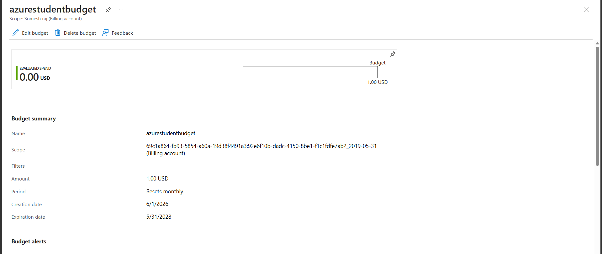

# AZ-900 Static Website Project

## Project 1

This is a beginner-friendly Microsoft Azure AZ-900 project.  
I hosted a static website using Azure Storage Static Website Hosting.

This project helped me understand basic Azure cloud concepts such as Resource Groups, Storage Accounts, Blob Storage, static website hosting, and cloud-based deployment.

## Live Website

Website URL:  
https://staticwebappaz900.z29.web.core.windows.net/

## Azure Services Used

- Azure Resource Group
- Azure Storage Account
- Azure Blob Storage
- Static Website Hosting
- `$web` Container

## Project Architecture

User Browser  
→ Azure Static Website Endpoint  
→ Azure Storage Account  
→ `$web` Container  
→ `index.html` and `404.html`

## Features

- Static website hosted on Microsoft Azure
- Colorful portfolio-style webpage
- Custom 404 error page
- Beginner-friendly AZ-900 cloud project
- Hosted using Azure Storage Static Website feature

## Steps Followed

1. Created a Resource Group in Azure.
2. Created a Storage Account.
3. Enabled Static Website Hosting.
4. Uploaded `index.html` and `404.html` into the `$web` container.
5. Tested the website using the Primary Endpoint URL.
6. Verified that the website is accessible from a browser.

## What I Learned

- How Azure Resource Groups are used to organize resources.
- How Azure Storage Accounts work.
- How Blob Storage can be used to store website files.
- How the `$web` container is used for static website hosting.
- How to host a simple website using Azure without using a traditional web server.

## Project 2: Azure Cost Management Budget

### Project Overview

This project demonstrates how to create a budget in Azure Cost Management to monitor cloud spending.

I created a monthly budget for my Azure for Students subscription to understand Azure cost monitoring, spending limits, and budget alerts.

### Azure Services Used

- Azure Cost Management
- Azure Budget
- Azure Subscription
- Cost Alerts

### Budget Configuration

- Budget Name: `azurestudentbudget`
- Reset Period: Monthly
- Budget Amount: `$1`
- Alert Type: Actual Cost
- Alert Thresholds: 50%, 80%, and 100%

### Steps Followed

1. Opened Azure Cost Management + Billing.
2. Selected the subscription scope.
3. Created a monthly budget.
4. Added actual cost alert conditions.
5. Added email recipient for alert notification.
6. Verified the budget in the Budgets dashboard.

### Screenshot

### What I Learned

- How Azure Cost Management works.
- How to create a monthly budget.
- How actual cost alerts work.
- How Azure helps monitor cloud spending.
- Budget alerts notify users but do not automatically stop resources.
